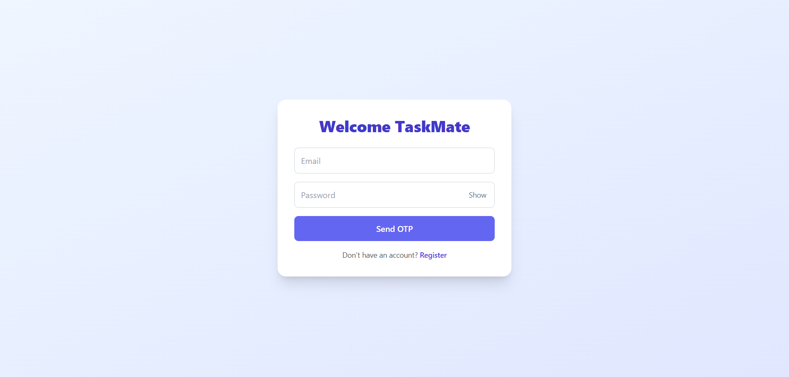
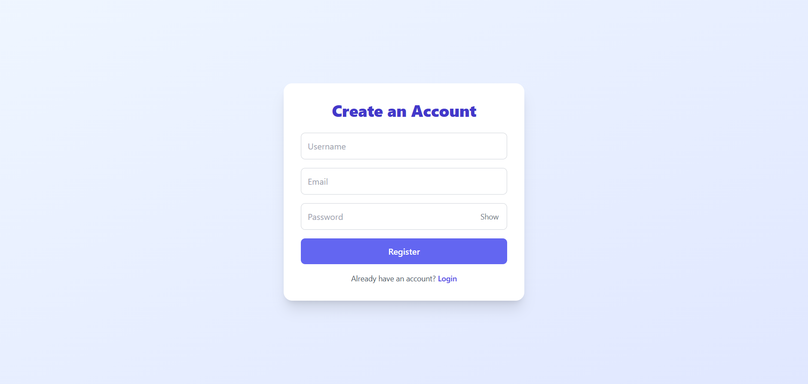
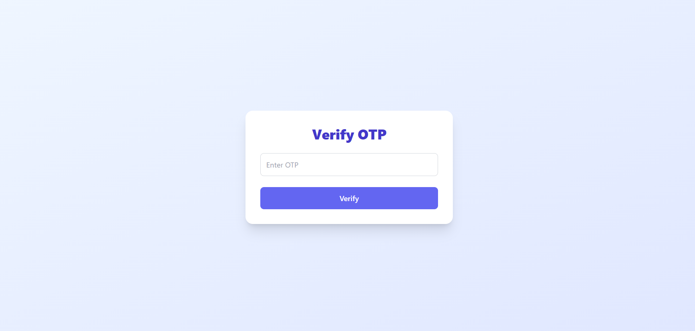
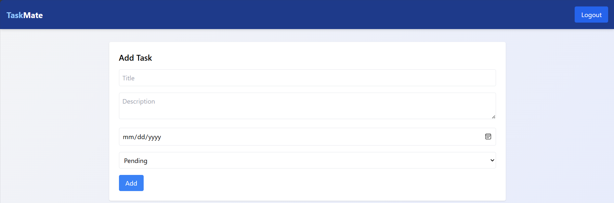
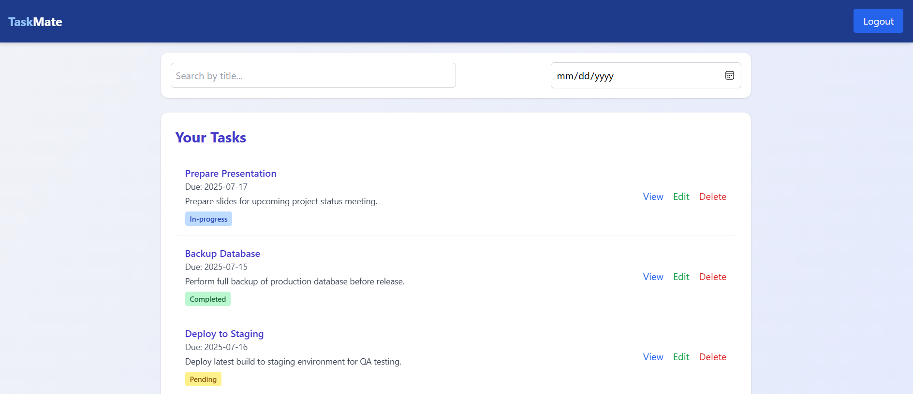
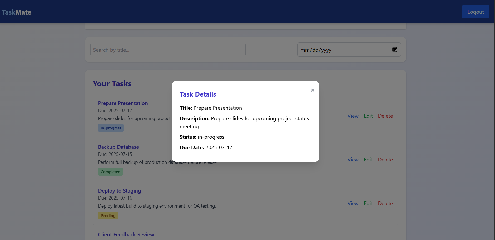
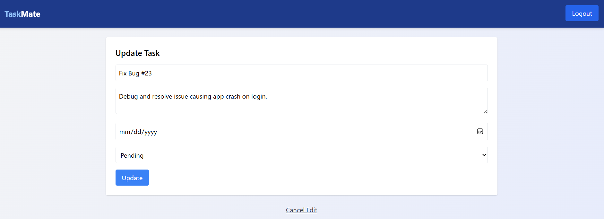

# 📝 Task Management App

A full-stack task management application built with **React**, **Node.js**, **Express**, and **MongoDB**. It supports user registration, secure login with OTP verification, and features task CRUD operations with filters, sorting, and due date management.

---

## 🚀 Features

### 🔐 Authentication

- Register with username, email, and password
- Login with email/password + OTP (email verification)
- JSON Web Tokens (JWT) for protected routes

### ✅ Task Management

- Create, read, update, and delete tasks
- Filter tasks by status, search query, and due date
- Sort tasks by creation date or due date

### 💄 UI/UX

- Protected routes via `PrivateRoute`
- Responsive design with TailwindCSS
- Loading spinners and smooth navigation

---

## 🖼️ Project Screenshots

Here are some previews of the TaskMate app:

  
  
  
  
  
  


---

## 🧩 Tech Stack

### Frontend

- React 19
- Vite
- React Router v7
- Axios
- Tailwind CSS

### Backend

- Node.js
- Express
- MongoDB with Mongoose
- Nodemailer for sending OTP emails

---

## 📂 Project Structure

### Backend

```
backend/
├── controllers/
├── middlewares/
├── models/
├── routes/
├── utils/
├── .env
└── server.js
```

### Frontend

```
frontend/
├── public/
├── src/
│   ├── assets/
│   ├── components/
│   ├── pages/
│   ├── services/
│   └── App.jsx
├── .env
├── index.html
└── vite.config.js
```

---

## 🛠️ Setup Instructions

### Prerequisites

- Node.js & npm
- MongoDB Atlas account

### 1. Clone the repository

```bash
git clone https://github.com/lakshitha1128/-TaskMate---task-management-web-application-.git
cd task-manager-web-application
```

---

### 2. Setup Backend

```bash
cd backend
npm install
```

- Create a `.env` file in the `backend/` folder with:

```env
PORT=5000
MONGO_URI=your_mongodb_connection_string
JWT_SECRET=your_jwt_secret
EMAIL_USER=your_email@gmail.com
EMAIL_PASS=your_email_password_or_app_password
```

- Start the backend server:

```bash
npm run dev
```

---

### 3. Setup Frontend

```bash
cd ../frontend
npm install
```

- Create a `.env` file in the `frontend/` folder with:

```env
VITE_API_URL=http://localhost:5000/api
```

- Start the frontend:

```bash
npm run dev
```

---

## 📫 Contact

If you have any questions or suggestions, feel free to contact:

**Lakshitha Charaka**  
📧 lakshithaw900@gmail.com
